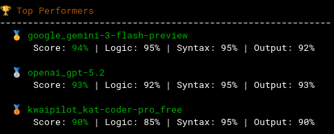

# LLModelScoring

A PHP application that evaluates capabilities (like programming or other textual generation) of different LLM models via the OpenRouter API.



## Features

- **Model Fetching**: Fetch all models from OpenRouter and export to editable CSV
- **Selective Testing**: Choose which models to test by editing the CSV file
- **Resumable Evaluation**: Safe resume after interruption (idempotent)
- **Complete Storage**: All model outputs saved for follow-up evaluation
- **Follow-up Conversations**: Ask additional questions to tested models
- **Multiple Reports**: CLI and HTML output formats

## Quick Start

```bash
# Install dependencies
composer install

# Copy environment template
cp .env.example .env

# Add your OpenRouter API key to .env
# OPENROUTER_API_KEY=your_key_here

# Fetch all models and create models.csv
php llm-scoring.php fetch

# Edit data/default/models.csv to select which models to test (enabled=1)

# Create data/default/task.md with instructions about the task to be executed.

# Create data/default/evaluator-hints.md with instructions the results should be evaluated, include specifics for what you are looking for.

# Test selected models (resumes automatically if interrupted)
php llm-scoring.php test

# Reset and start fresh
php llm-scoring.php test --reset

# View results
php llm-scoring.php list

# Generate report
php llm-scoring.php report --format html
```

When you run `php llm-scoring.php` without any command, you'll see a help overview with quickstart instructions.

## CLI Commands

### Main Commands

| Command                   | Description                                                                                   |
| ------------------------- | --------------------------------------------------------------------------------------------- |
| `fetch`                   | Fetch all models from OpenRouter to CSV                                                       |
| `list-models`             | View models in CSV with filtering                                                             |
| `test --from-csv`         | Test models from CSV (enabled only)                                                           |
| `test --from-csv --reset` | Reset and start fresh evaluation                                                              |
| `status`                  | Show evaluation progress                                                                      |
| `show <model_id>`         | Display model test data (prompts, responses, evaluations, costs)                              |
| `list`                    | List all tested models (with cost aggregation)                                                |
| `evaluate [<model_id>]`   | Evaluate stored model content using an LLM. Omit model_id to evaluate all unevaluated models. |
| `export-models`           | Export models from CSV to various formats                                                     |
| `report`                  | Generate evaluation reports (CLI or HTML format)                                              |
| `stats`                   | Display evaluation statistics                                                                 |

### Evaluate Command Options

| Option        | Description                                        |
| ------------- | -------------------------------------------------- |
| `model_id`    | The model ID to evaluate (optional, omit for all)  |
| `-t, --test`  | Test number (default: latest)                      |
| `-m, --model` | Evaluator model (default: EVALUATOR_MODEL env)     |
| `-r, --raw`   | Show raw JSON output                               |
| `-a, --all`   | Evaluate all unevaluated models (same as omitting) |

### Evaluate Usage Examples

```bash
# Evaluate a single model
php llm-scoring.php evaluate meta-llama/llama-3.1-8b-instruct

# Evaluate all unevaluated models at once
php llm-scoring.php evaluate

# Or explicitly with --all flag
php llm-scoring.php evaluate --all
```

### Show Command Options

| Option       | Description                     |
| ------------ | ------------------------------- |
| `model_id`   | The model ID to show (required) |
| `--test, -t` | Specific test number to show    |
| `--raw, -r`  | Show raw JSON output            |

### List Command Options

| Option          | Description                            |
| --------------- | -------------------------------------- |
| `--format, -f`  | Output format: table (default) or json |
| `--details, -d` | Show additional details (full paths)   |

### Test Command Options

| Option                  | Description                                             |
| ----------------------- | ------------------------------------------------------- |
| `--from-csv, --input`   | CSV file path (default: data/models.csv)                |
| `--all, -a`             | Test all models including disabled                      |
| `--free-only, -f`       | Only test free models                                   |
| `--limit, -l`           | Limit number of models to test                          |
| `--prompt, -p`          | Custom prompt to send to models                         |
| `--experiment-code, -q` | Question code for organizing results (default: default) |
| `--reset`               | Reset evaluation state before starting                  |

### Question Code

Commands support a `--experiment-code` (or `-q`) option to organize results into separate subdirectories. This allows you to:

- **Separate different tests**: Run the same task with different prompts
- **Track experiments**: Compare results across different question sets
- **Unit testing**: Use `--experiment-code=unittests` for isolated test runs

| Question Code | Use Case                                          |
| ------------- | ------------------------------------------------- |
| `default`     | Standard testing (used when no code is specified) |
| `unittests`   | Unit testing with Pest                            |
| Custom code   | Your own experiment name (e.g., `my-experiment`)  |

**Data Storage Structure:**

```
data/models/
├── default/           # Standard test results
│   └── <model_id>/
│       ├── 01_test_prompt.json
│       ├── 01_raw_response.json
│       └── 01_evaluation.json
├── unittests/         # Unit test results
│   └── <model_id>/
│       └── ...
└── my-experiment/     # Custom experiment
    └── <model_id>/
        └── ...
```

**Usage Examples:**

```bash
# Test with default question code
php llm-scoring.php test --from-csv

# Test with custom question code
php llm-scoring.php test --from-csv --experiment-code=my-experiment

# Test for unit tests
php llm-scoring.php test --from-csv --experiment-code=unittests

# List results for a specific question code
php llm-scoring.php list --experiment-code=my-experiment

# Evaluate results for a specific question code
php llm-scoring.php evaluate --experiment-code=my-experiment

# Show status for a specific question code
php llm-scoring.php status --experiment-code=my-experiment

# Generate report for a specific question code
php llm-scoring.php report --experiment-code=my-experiment

# Show statistics for a specific question code
php llm-scoring.php stats --experiment-code=my-experiment
```

### Task Definition

The task prompt is defined in `data/<experiment-code>/task.md`. This allows:

1. **Customize the task**: Edit `data/<experiment-code>/task.md` to change what models should do
2. **Version control**: Track changes to the task definition over time
3. **Multiple tasks**: Create different task files for different scenarios

**Format for `data/<experiment-code>/task.md`:**

# Task Definition

## Task Prompt

```markdown
Write a PHP script that counts down from 10 to 1, outputting each number on a new line. Only output the code, no explanations.
```

## Content Type

The prompt is extracted from the ` ```markdown ` code block. If no code block is found, the entire file content is used.

### Evaluator Hints

Evaluator hints are defined in `data/<experiment-code>/evaluator-hints.md` to provide task-specific guidance for the LLM evaluator. This allows:

1. **Custom evaluation criteria**: Define what makes good output for your specific task
2. **Detailed checks**: Specify exactly what to look for and what to deduct points for
3. **Examples**: Provide expected output format guidance

See `data/<experiment-code>/evaluator-hints.md` for the evaluation criteria.

### Export Models Command Options

| Option         | Description                                    |
| -------------- | ---------------------------------------------- |
| `--input, -i`  | Input CSV file path (default: data/models.csv) |
| `--output, -o` | Output file path (default: stdout)             |
| `--format, -f` | Output format: csv or json (default: csv)      |
| `--enabled`    | Only export enabled models                     |
| `--free-only`  | Only export free models                        |

### Report Command Options

| Option         | Description                                              |
| -------------- | -------------------------------------------------------- |
| `--format, -f` | Output format: cli (default) or html                     |
| `--output, -o` | Output file path for HTML format (default: results.html) |

### Stats Command Options

| Option       | Description              |
| ------------ | ------------------------ |
| `--json, -j` | Output as JSON           |
| `--detailed` | Show detailed statistics |

### Report Usage Examples

```bash
# Generate CLI report
php llm-scoring.php report

# Generate HTML report (saves to results.html)
php llm-scoring.php report --format html

# Generate HTML report with custom output path
php llm-scoring.php report --format html --output my-report.html
```

### Stats Usage Examples

```bash
# Show statistics in CLI format
php llm-scoring.php stats

# Show statistics in JSON format
php llm-scoring.php stats --json

# Show detailed statistics with score distribution
php llm-scoring.php stats --detailed
```

## Project Structure

```
LLModelScoring/
├── src/              # PHP source code
├── data/             # CSV files and model outputs
├── config/           # Configuration
├── tests/            # Unit and integration tests
├── llm-scoring.php   # CLI entry point
└── composer.json     # Dependencies
```

## Testing

Tests are run with Pest. Because the `pest.xml` configuration is used, run tests as follows:

```bash
# Run all tests
./vendor/bin/pest --configuration=pest.xml

# Unit tests only
./vendor/bin/pest --configuration=pest.xml tests/Unit/

# Specific test file
./vendor/bin/pest --configuration=pest.xml tests/Unit/ModelCsvTest.php
```

## Requirements

- PHP 8.4+
- Composer
- OpenRouter API key

## License

[](https://opensource.org/licenses/Apache-2.0)
